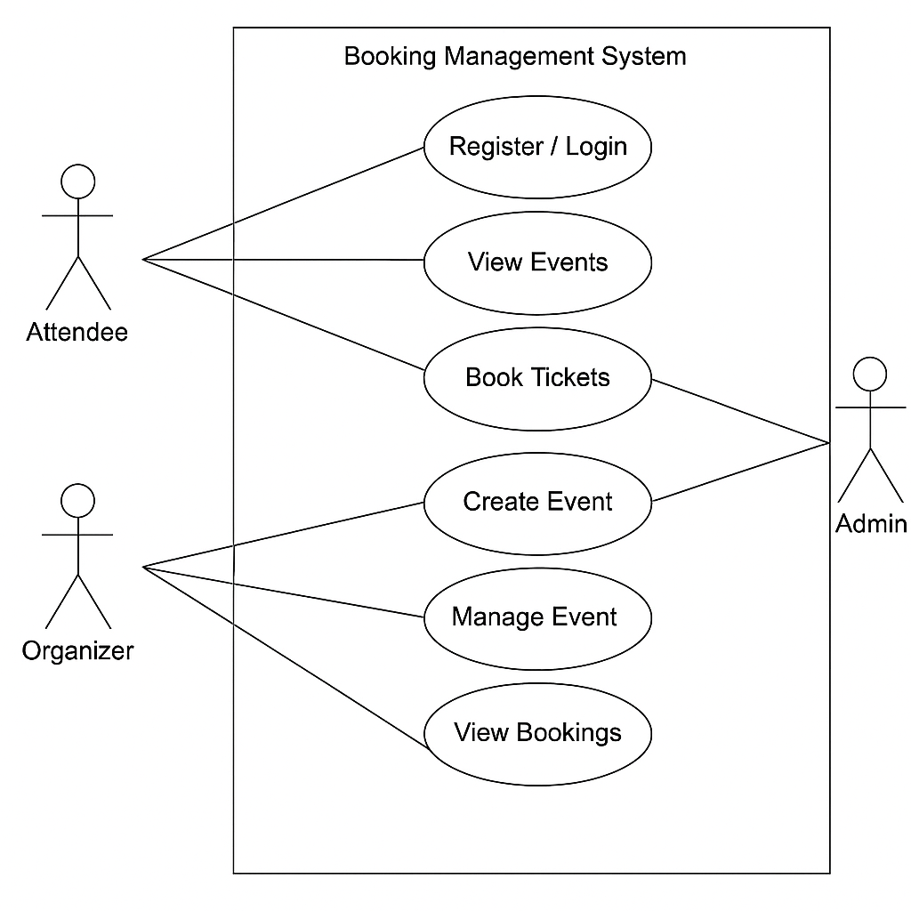

# Requirement Analysis in Software Development

This repository is dedicated to exploring the crucial phase of **Requirement Analysis** in the software development lifecycle. It provides an overview of techniques, tools, and documentation practices used to gather, analyze, and define software requirements. The content here is aimed at helping developers, analysts, and project stakeholders better understand how to translate business needs into actionable technical solutions.

## What is Requirement Analysis?

Requirement Analysis is a fundamental phase in the Software Development Life Cycle (SDLC) that involves identifying, documenting, and managing the needs and expectations of stakeholders for a software system. This process ensures that the development team fully understands what the end users and clients expect from the product before any design or coding begins.

## Why is Requirement Analysis Important?

1. **Foundation for Design and Development**  
   Requirement Analysis acts as the blueprint for the software design and development process. Without a clear understanding of what needs to be built, teams risk developing features that don't meet user needs or business goals.

2. **Improves Communication**  
   It bridges the gap between stakeholders (clients, end-users, business analysts) and the technical team, ensuring that everyone has a shared understanding of the project scope and objectives.

3. **Reduces Project Risks**  
   Clearly defined requirements help prevent scope creep, reduce misunderstandings, and minimize the need for costly changes later in the development process.

4. **Enhances Product Quality**  
   By identifying the correct functional and non-functional requirements early, teams can ensure the final product performs well, is user-friendly, and satisfies regulatory or compliance needs.

5. **Supports Testing and Validation**  
   Well-defined requirements provide the basis for creating effective test cases, ensuring that the final product meets the original business needs.

In essence, Requirement Analysis is a strategic step that sets the stage for successful software delivery. It aligns stakeholders, defines project goals, and ensures that development efforts are directed toward creating valuable and usable solutions.

## Key Activities in Requirement Analysis

Requirement Analysis is a multi-step process that ensures the right product is built for the right purpose. The following are the five key activities involved in this phase:

### 1. Requirement Gathering

This is the initial step where relevant information is collected from stakeholders such as clients, end-users, and business managers. The goal is to understand the expectations, goals, and constraints of the software system. Common techniques include interviews, questionnaires, observation, and reviewing existing documentation.

### 2. Requirement Elicitation

Elicitation is a deeper exploration into stakeholder needs. It goes beyond simply collecting information — it involves actively engaging with stakeholders to uncover underlying requirements, clarify ambiguities, and identify implicit needs. Techniques used may include workshops, brainstorming sessions, prototyping, and use case analysis.

### 3. Requirement Documentation

Once gathered and elicited, the requirements must be clearly documented in a structured format. This documentation may include a Software Requirements Specification (SRS), user stories, use cases, and business rules. Proper documentation ensures that all stakeholders have a consistent understanding of the requirements.

### 4. Requirement Analysis and Modeling

In this phase, the documented requirements are analyzed for clarity, feasibility, consistency, and completeness. Modeling techniques such as data flow diagrams (DFDs), entity-relationship diagrams (ERDs), and UML diagrams are often used to visualize and better understand the system’s structure and behavior.

### 5. Requirement Validation

Validation ensures that the documented requirements accurately reflect stakeholder needs and are ready for the design and development stages. This involves reviewing the requirements with stakeholders, checking for alignment with business goals, and verifying that the requirements are testable and unambiguous.

---

These activities form the backbone of a successful Requirement Analysis process. When done correctly, they ensure that the software developed is aligned with user expectations and business objectives.

## Types of Requirements

In software development, requirements are generally categorized into two main types: **Functional Requirements** and **Non-functional Requirements**. Both are critical to ensuring that the system performs as intended and meets user expectations.

### Functional Requirements

Functional requirements define the specific behavior or functions of the system. They describe what the system should do and how it should respond to user inputs.

**Examples for the Booking Management Project:**
- Users must be able to register and log in to the system as either attendees or organizers.
- Organizers should be able to create, update, and delete events.
- Attendees must be able to browse events and book tickets.
- The system should send confirmation emails to users after successful booking.
- The system must track the number of tickets available and prevent overbooking.
- Admins should be able to view and manage all bookings and events.

These requirements define the **core operations** that support the goals of the event booking system.

### Non-functional Requirements

Non-functional requirements describe how the system performs a function rather than what the function is. They cover aspects like usability, performance, security, and reliability.

**Examples for the Booking Management Project:**
- The system should be able to handle at least 500 concurrent users without performance degradation.
- Pages should load within 2 seconds on a standard broadband connection.
- All sensitive user data must be encrypted in transit and at rest.
- The platform must be accessible and responsive on both desktop and mobile devices.
- The system should have a 99.9% uptime guarantee.
- Users must be automatically logged out after 10 minutes of inactivity for security.

These requirements ensure that the system is **efficient, secure, and user-friendly** under real-world conditions.

## Use Case Diagrams

**Use Case Diagrams** are visual representations of a system’s functional requirements and the interactions between users (actors) and the system. They help illustrate what the system will do from a user's perspective and define the scope of the system in a simple and understandable format.

### Benefits of Use Case Diagrams

- **Clarity**: They provide a clear overview of system functionality and user interactions.
- **Communication**: Help facilitate communication between stakeholders, including developers, business analysts, and clients.
- **Planning**: Useful in identifying system boundaries, roles, and responsibilities early in the project.
- **Validation**: Assist in validating the completeness of functional requirements.

### Use Case Diagram for the Booking Management System

Below is a use case diagram for the event booking system, showing the primary actors and their interactions with the system:

## Acceptance Criteria

**Acceptance Criteria** are a set of predefined conditions that a software product must satisfy to be accepted by a user, customer, or other stakeholders. They define the boundaries and expectations of a feature and help ensure that all requirements are met before development is considered complete.

### Importance in Requirement Analysis

- **Clarity**: They provide clear, testable conditions for success.
- **Alignment**: Help ensure that the development team and stakeholders are aligned on what a “completed” feature looks like.
- **Quality Assurance**: Serve as a foundation for writing test cases and validating the final output.
- **Scope Management**: Prevent scope creep by clearly stating what is included and excluded in a feature.

### Example: Acceptance Criteria for the Checkout Feature

**Feature:** *Checkout for Booking Tickets*

**Acceptance Criteria:**
1. The user must be logged in to access the checkout page.
2. The system must display a summary of selected tickets, including event name, quantity, and total price.
3. The user must be able to enter or select saved payment details.
4. The payment must be processed securely via the integrated payment gateway (e.g., Chapa).
5. Upon successful payment, the system must:
   - Generate a unique booking reference.
   - Update the event’s available ticket count.
   - Send a confirmation email with booking details to the user.
6. If payment fails, the system must display an appropriate error message and allow the user to retry.
7. The entire checkout process must complete within 10 seconds under normal load conditions.

This helps ensure that both functional and non-functional requirements for the feature are well-understood and testable.

